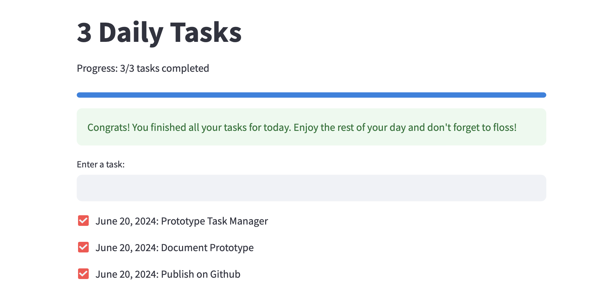

# 3 Daily Tasks

A simple task manager app built with Streamlit to help you track and complete your daily tasks.

## Features

- Add tasks with today's date.
- Mark tasks as completed.
- Track progress visually with a progress bar.
- Archive completed tasks.
- Receive a congratulatory message when all tasks are done.

## Screenshot



## Installation

1. Clone the repository:

```bash 
git clone https://github.com/mariru/3-daily-tasks.git
cd 3-daily-tasks
```

2. Create virtual environment (e.g., with conda) and install streamlit:

```bash 
conda create -n taskmanager
conda activate taskmanager
pip install -r requirements.txt
```

3. Run the app:

```bash 
streamlit run app.py
```
This will start a local server and open your web browser to view the app.

## Contributing

Contributions are welcome! Please fork the repository and submit a pull request.

## License 


This project is licensed under the MIT License.